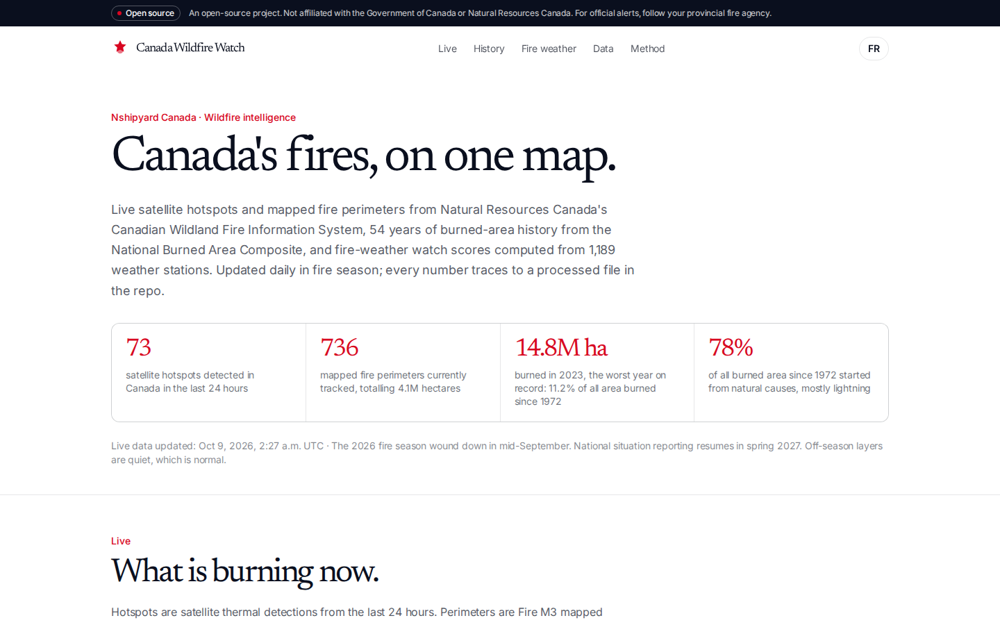
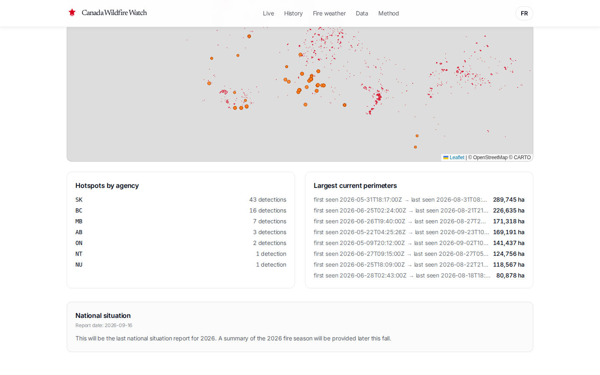
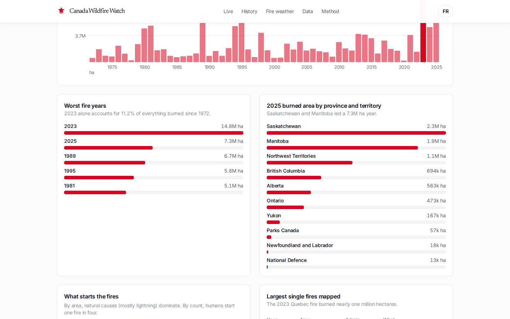
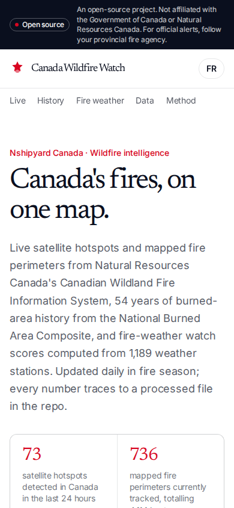
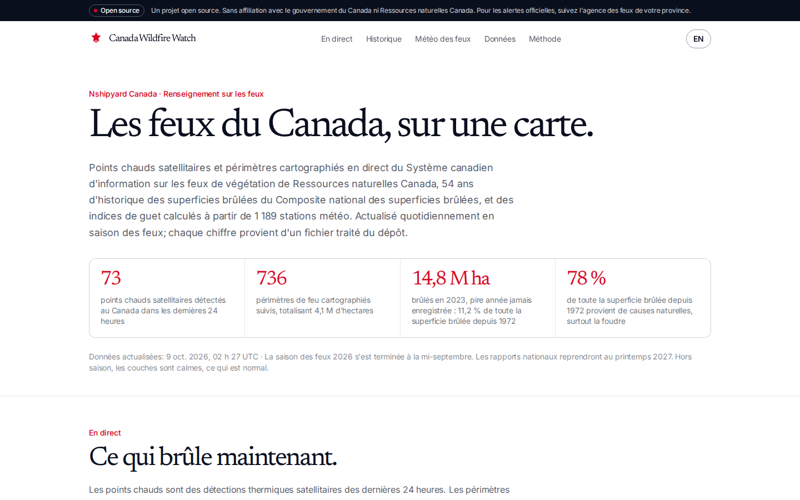

# Canada Wildfire Watch

Live Canadian wildfire intelligence: satellite hotspots and mapped fire perimeters from Natural Resources Canada, 54 years of burned-area history, and explainable fire-weather watch scores. English and French. Open data, MIT licensed.

**Live:** https://fire.canada.nshipyard.com

An Open Nshipyard project. Not affiliated with the Government of Canada or Natural Resources Canada. For evacuation orders and official alerts, follow your provincial or territorial fire agency.

## What v1 is

An operational dashboard fusing live and historical open fire data. It is not a trained model and it makes no predictions:

- **Live layer:** 24h satellite hotspots (Canada-filtered) and Fire M3 active perimeters from the Canadian Wildland Fire Information System public web services, plus the official Fire Danger Rating and 1,961 fire-weather station observations. Refreshed by `scripts/refresh_live.py`; every view shows its data timestamp.
- **Historical layer:** National Burned Area Composite 1972-2025: 52,610 mapped fires, 132.6M hectares. 2023 burned 14.8M ha, the worst year on record.
- **Intelligence layer (honest):** an explainable watch index from station observations (hot + dry + windy, 0-100), with the formula published in the methodology. It describes observed conditions; it does not predict ignition or spread.

v2 (AlphaEarth change detection, WeatherNext forecast integration) is specified in `docs/v2-models.md` and deliberately not claimed by v1.

## Data pipeline

```
scripts/build_data.py    NBAC summary workbook -> data/historical.json (20 KB)
scripts/refresh_live.py  CWFIS WFS + situation API -> data/live/*.json
```

Raw downloads are never committed. Run `refresh_live.py` daily during fire season (May to mid-September); CWFIS national reporting pauses over winter.

## Develop

```bash
npm install
npm run dev      # http://localhost:3000
npm run build    # production build
```

API: `/api/v1/live`, `/api/v1/history`, `/api/v1/stations` (no key).

## Sources

- Natural Resources Canada, Canadian Wildland Fire Information System: live hotspots, perimeters, fire danger rating, weather stations, situation reports (https://cwfis.cfs.nrcan.gc.ca)
- National Burned Area Composite summary statistics 1972-2025 (https://cwfis.cfs.nrcan.gc.ca/downloads/nbac)

## Screenshots







## Author

Built by **Richardson Dackam** · [X](https://x.com/richardsondx) · [GitHub](https://github.com/richardsondx)
